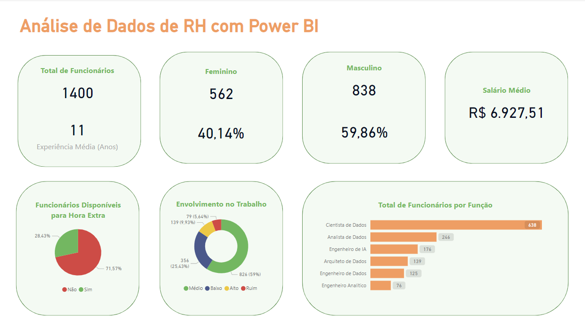

# Análise de Dados de Recursos Humanos

Esse Projeto foi realizado no capítulo de 06 do curso **"Microsoft Power BI Para Business Intelligence e Data Science"** da *Data Science Academy*.

A área de Recursos Humanos (RH) tem como função principal gerenciar e administrar as atividades relacionadas ao pessoal de uma empresa, a fim de promover o desenvolvimento e a satisfação dos funcionários e, consequentemente, contribuir para o sucesso da organização.

Por conta disso, ter um dashboard para analisar os KPIs (Indicadores Chave de Desempenho) na área de Recursos Humanos é muito importante, pois ajuda a retirar informações de grande valor para o negócio, como:
<ul>
    <li><b>Taxa de Rotatividade</b></li>
    <li><b>Satisfação do funcionário</b></li>
    <li><b>Tempo médio para preenchimento das vagas</b></li>
    <li><b>Custo de contratação por funcionário</b></li>
    <li><b>Participação em treinamentos</b></li>
    <li><b>Avaliação de Desempenho</b></li>
    <li><b>Nível de absenteísmo</b></li>
    <li><b>Nível de engajamento</b></li>
</ul>

## O objetivo desse dashboard:

O objetivo desse dashboard foi responder algumas perguntas fornecidas da Gestão de Recursos Humanos, que precisa de informações para dar continuidade nas tomadas de decisão.
### O dashboard deve responder as seguintes perguntas:
1- Qual o total de funcionários atualmente na empresa?
2- Qual otempo médio de experiência dos funcionários (em anos)?
3- Qual o total e percentual de funcionários do gênero masculino e feminino?
4- Qual a média salarial mensal?
5- Qual o total de funcionários por função?
6- Qual o percentual defuncionários disponíveis para fazer hora extra?
7- Qual o nível de envolvimento dos funcionários no trabalho considerando **4 categorias: Ruim, Baixo, Médio e Alto**?
8- Este item não deve estar no Dashboard, mas precisa ser calculado: Qual o total e o percentual de funcionários que devem receber promoção? Considere a coluna “Anos Desde a última Promoção” com a seguinte regra: Se o funcionário tiver 5 anos ou mais desde a última promoção, deve ter a promoção considerada. Caso contrário, a promoção não deve ser considerada agora.

## Imagem do Dashboard
